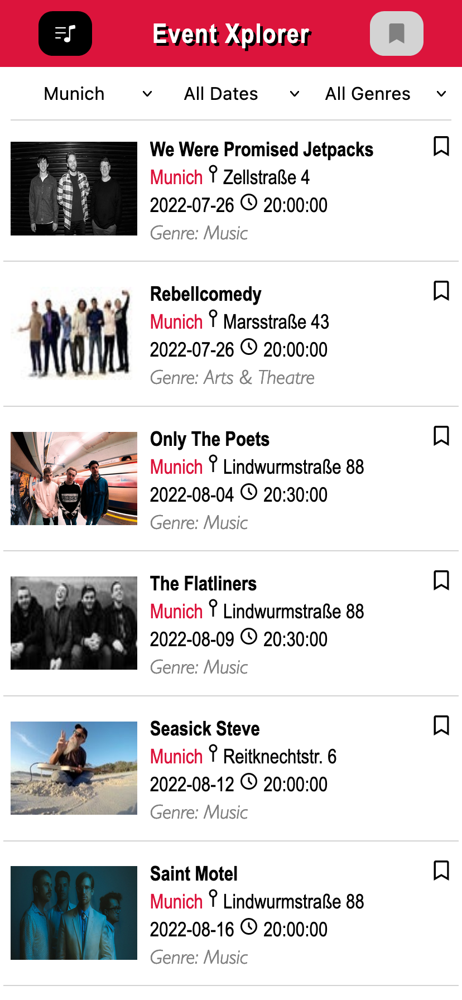

# Event Xplorer

### An app for upcoming events in your city

The Event Xplorer App provides users with an overview of upcoming events in the city. Users can filter the event list by city, date and genre and bookmark all events that are interesting to them. 

## Tech Stack

- React
- React Testing Library
- Jest
- Styled Components
- Storybook
- Ticketmaster API
- Figma
- Stylelint
- Eslint
- Prettier

## `Project setup`

1. Clone this repository.
2. Install all npm dependencies

   `npm install`

3. To run the app in development mode npm start, then open http://localhost:3000 to view it in the browser
4. To run Storybook
   `npm run storybook`
5. To run unit and component tests
   `npm test`

